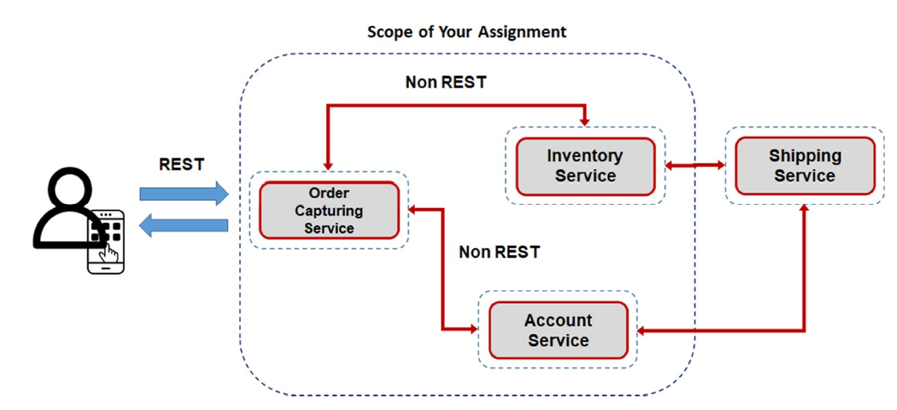

# Asynchronous communication between micro services

My apology, difficulis to budget, [AWS EKS](https://aws.amazon.com/eks/) is too expensive and timeframe it is too short for me to pick another cloud technology. I don't provide a solution of microservices.

By the way, it didn't stop me to commit this assignment. I would like to show another idea to meet the goals which is **serverless**. 

## Test it

You may refer [swagger.yaml](./swagger.yaml). Unfortunately, my company laptop only allow me to run it in localhost ( see my [poc-swagger-js](https://github.com/laytzehwu/poc-swagger-js) ). By the way, [postman](./Order%20capture.postman_collection.json) is working with the testing site.

## System design

By referring [sam-template.yaml], you may see above design.

### Rest Api

- [ApiGatewayApi] is a [AWS Api Gateway](https://aws.amazon.com/api-gateway/), it receives Rest calls from the client and distributes the work to [AWS Lambda].

- [OrderAPIGatewayFuntion](./aws/sam-template.yaml#L414-L450), a [AWS Lambda] receives Rest calls from [ApiGatewayApi] and handles below requests:

| Method |  Path  | Remarks |
|--------|--------|---------|
|  POST  | /order | Create an order and store in [OrderDynamoDBTable](#orderdynamodbtable) |
|  POST  | /orders| Receives multiple orders with different customers |

- [AccountUpdateFunction](./aws/sam-template.yaml#L452-L473) a [AWS Lambda] receives Rest calls from [ApiGatewayApi] and handles below requests:

| Method |  Path  | Remarks |
|--------|--------|---------|
|  POST  | /account | Create an order and store in [AccountDynamoDBTable](#accountdynamodbtable)|

### Fan-out

[OrderAPIGatewayFuntion] received the order(s), it just only stores it(them) to [OrderDynamoDBTable](#orderdynamodbtable) then trigger [AWS Simple Notification Service (SNS)].

In this assignment, [OrderTopic] was created and distributes the work to [BalanceCheckerQueue] and [StockCheckerQueue]:

- [OrderTopic] is an [AWS Simple Notification Service (SNS)], not only send email, it also can makes http/https call. Most important is able to trigger [AWS Lambda].

- [BalanceCheckerQueue] is an [AWS Simple Queue Service (SQS)],  

- [StockCheckerQueue] is an [AWS Simple Queue Service (SQS)], 

## Storage

By using [DynamoDB] and creates tables as below:

### OrderDynamoDBTable

[OrderDynamoDBTable](./aws/sam-template.yaml#L596-L607) stores orders.

### AccountDynamoDBTable

[AccountDynamoDBTable](./aws/sam-template.yaml#L609-L620) stores credit balance as field *balance* with field *customerId*. Just simple design to tell how credit that the customer has.

### StockDynamoDBTable

[StockDynamoDBTable](./aws/sam-template.yaml#L622-L633) stores stock balance as field *balance* with field *productId*. It represent how of that specific product can be sold.

## Deployment

Run [deploy.sh](./deploy.sh) which is invoking [AWS SAM] to build and deploy a [CloudFormation] stack by referring [sam-template.yaml] CloudFormation template for deployment.

## What is missing?

Because of AWS EKS is expense, my solution is using serverless. There is no container in the solution. By the way, please refer [Assigment 4](../assignment4/README.md) for Build and Dockerized

[CloudFormation]: https://aws.amazon.com/cloudformation/
[AWS SAM]: https://aws.amazon.com/serverless/sam/
[sam-template.yaml]: ./aws/sam-template.yaml
[AWS Lambda]: https://aws.amazon.com/lambda/
[DynamoDB]: https://aws.amazon.com/dynamodb
[AWS Simple Notification Service (SNS)]: https://aws.amazon.com/sns/ 
[AWS Simple Queue Service (SQS)]: https://aws.amazon.com/sqs/

[ApiGatewayApi]: ./aws/sam-template.yaml#L330-L350
[OrderTopic]: ./aws/sam-template.yamll#L374-L398
[BalanceCheckerQueue]: ./aws/sam-template.yaml#L353-L358
[StockCheckerQueue] ./aws/sam-template.yaml#L360-L365
