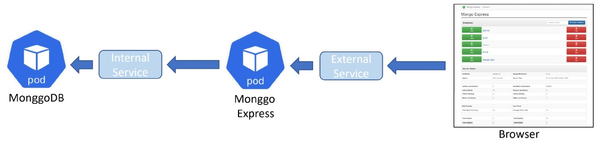

# Exercise to deploy MongoDB & Mongo Express

There are something to be provisioned get the MongoDB admin tools be accessibile like a Website. They can provisioned in below sequence:

1. [Namespace] group relate stuff
2. [Secret] keeps credential for MongoDB
3. A [Service] with a [Deployment] which run [Pods] contains [mongo] image, we need [Secret] to tell credential when MongoDB is being setting up
4. [ConfigMap] to keep the url of [mongo]'s [Service]
5. 2nd [Service] with a [Deployment] with [mongo-express] image where we need [ConfigMap] to tell the url of [mongo]'s [Service]
6. [Ingress] maks [mongo-express]'s [Service] to a website, not just domain but other stuf like tls

## Namespace

I have created a [Namespace] named **ahlay-namespace**, see [namespace.yml](./templates/namespace.yml). It is an idea to group related resources. The namespace was created by run below kubectl command:

> kubectl apply -f templates/namespace.yml

Note: I tried to relate what I did with *openshift-template.yml* before. So that I placed all the yaml files into a templates folder.

## Prerequisite of mongo

I tried to use [mongo] and found prerequisite of using it. It is expecting username and password to be passed in by environment variables:

- MONGO_INITDB_ROOT_USERNAME - Root user name
- MONGO_INITDB_ROOT_PASSWORD - Root password

Here is the description:
> These variables, used in conjunction, create a new user and set that user's password. This user is created in the admin [authentication database](https://www.mongodb.com/docs/manual/core/security-users/#user-authentication-database) and given [the role of root](https://docs.mongodb.com/manual/core/security-built-in-roles/#superuser-roles), which is [a "superuser" role](https://docs.mongodb.com/manual/core/security-built-in-roles/#superuser-roles).

## Root credential

I used **ahlay** as the super user name but encrypted base 64 and obtain *YWhsYXk=*:

> echo -n 'ahlay' | base64

Then another round to obtain password *YWhsYXktcGFzc3dvcmQ=*:

> echo -n 'ahlay-password' | base64

I am think of making used for Kubernetes [Secret]. It is a common practise to manage password, key, or other important not suppose to knowed by others.

## Create Secret

Same like creating namespace, I drafted [secret.yml] where introduce new [Secret] named **mongodb-secret** to the namespace by run [secret.yml] as below:

> kubectl apply -f templates/secret.yml

Note: It seem like storing password in the repo, and not accepted in actual practise. I believe there must has a better idea to manage such sensitive data or [secret.yml] should be kept separately. 

## Mongo service

Same as [Openshift], Pod is a smallest unit and run one or more containers. From the best practise I just read, defines [Deployment] where includes [ReplicaSet](https://kubernetes.io/docs/concepts/workloads/controllers/replicaset/) maintain a stable set of Pods. Beside the Pods themself, we want it to be accessable. This is the reason to add [Service]. I have drafted [mongo.yml] where define `image: mongo` in **containers** spec. By the way, **mongodb-secret** is being referred via **secretKeyRef** for environment variables **MONGO_INITDB_ROOT_USERNAME** and **MONGO_INITDB_ROOT_PASSWORD**. Run [mongo.yml] like below command to create a new [Deployment] named **mongodb-deployment** and a new [Service] named **mongodb-service**:

> kubectl apply -f templates/mongo.yml

## ConfigMap is required by mongo-express

From the documentation of [mongo-express], there is an expected environment variable **ME_CONFIG_MONGODB_SERVER** to appoint **mongo**. Same as [Openshift], Kubernetes offers [ConfigMap] (actually they are the same, [Openshift] inherit from Kubernetes) which stores settings not sensitive. 

I drafted [configmap](./templates/configmap.yml) where introduce a new [ConfigMap] named **mongodb-configmap** to obtain **database_url** of **mongodb-service** by running below command:

> kubectl apply -f templates/configmap.yml

Another 2 environment variables:
- ME_CONFIG_MONGODB_ADMINUSERNAME - user name which can be served by key **mongo-root-username** of **mongodb-secret** [Secret]
- ME_CONFIG_MONGODB_ADMINPASSWORD - password which can be served by key **mongo-root-password** of **mongodb-secret** [Secret]

Then it is sufficient to draft [mongo_express.yml](./templates/mongo_express.yml) to create a new [Deployment] named **mongodb-express-deployment** and a new [Service] named **mongodb-express-service**. Let's run below command:

> kubectl apply -f templates/mongo_express.yml

## Ingress

Although set [mongo-express] type to [LoadBalancer](https://kubernetes.io/docs/concepts/services-networking/service/#loadbalancer) can provision a load balancer and specify an external IP to be accessed outside the cluster.

By the way, there is more options from [Ingress] like domain and specify tls. Here by, I drafted [ingress.yml](./templates/ingress.yml) where configure host **ahlay.com** (of course I am not going register this domain ;) ). Run below command to provision a new [Ingress] named **mongodb-ingress**:

> kubectl apply -f templates/ingress.yml

[Openshift]: https://www.redhat.com/en/technologies/cloud-computing/openshift
[Namespace]: https://kubernetes.io/docs/concepts/overview/working-with-objects/namespaces/
[Deployment]: https://kubernetes.io/docs/concepts/workloads/controllers/deployment/
[Pods]: https://kubernetes.io/docs/concepts/workloads/pods/
[Service]: https://kubernetes.io/docs/concepts/services-networking/service/
[Secret]: https://kubernetes.io/docs/concepts/configuration/secret/
[ConfigMap]: https://kubernetes.io/docs/concepts/configuration/configmap/
[Ingress]: https://kubernetes.io/docs/concepts/services-networking/ingress/
[secret.yml]: ./templates/secret.yml
[mongo.yml]: ./templates/mongo.yml
[mongo-express]: https://hub.docker.com/_/mongo-express
[mongo]: https://hub.docker.com/_/mongo
